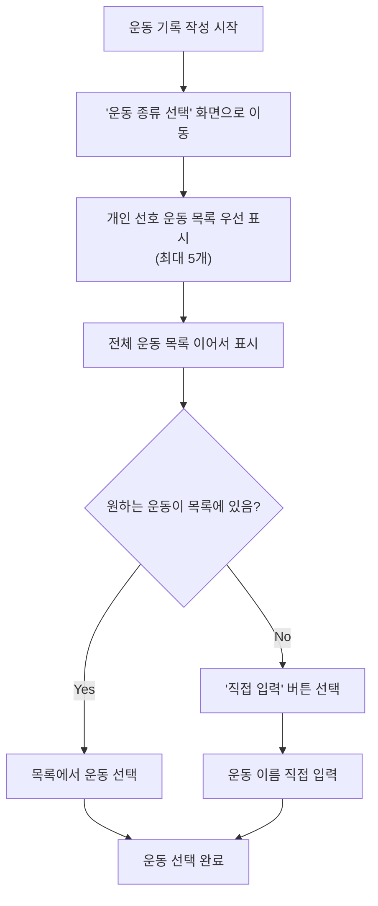
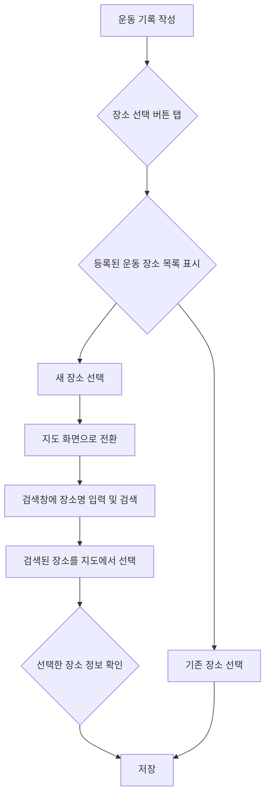
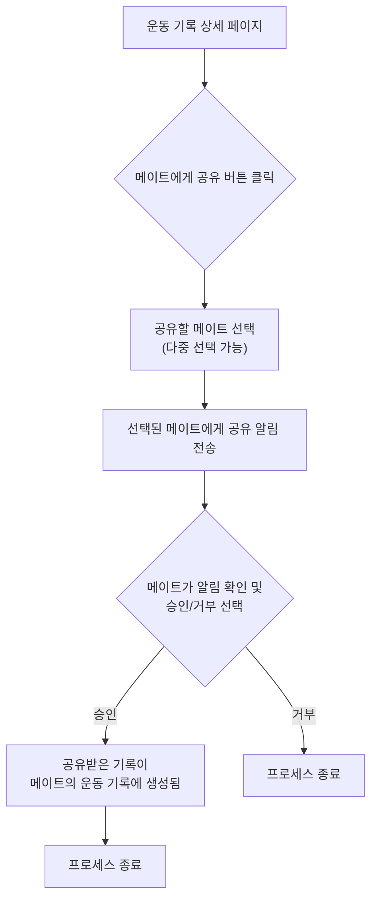

# 프로젝트명: 운동 기록 기능 리팩토링 회의

## 작성자

- 신동원
- 이동권
- 이주현

## 개요

> 이 프로젝트는 무엇인지, 목적은 무엇이며, 무엇을 달성하고자 하는지 간략하게 설명합니다.
> 

이 프로젝트는 현재 개발된 운동 기록 기능을 사용자 친화적이고 데이터 기반의 경험으로 리팩토링하는 것을 목표로 합니다. 사용자들이 운동 기록을 더 쉽고 정확하게 남기고, 타인과 기록을 공유할 수 있도록 하여 서비스 전반의 사용자 만족도와 참여도를 높이는 것을 목적으로 합니다.

- 운동 종류의 카테고리화 및 사용자 정의 입력 기능 도입
- 운동 장소 입력 방식 개선 (지도 기반 선택)
- 운동 기록 공유 기능 구현

- 아이디어
    - 운동종류의 카테고리화
        - 운동종류를 선택 해 주세요 버튼을 누르면 운동 종류 리스트가 나오고, 거기에 없으면 직접 입력하는 방향으로 리팩토링
    
    - 장소도 직접 입력하는것에서, 맵에서 선택하는 식 으로 변경(사용자 입장에서 더 간편함)
    
    - 운동 진취도를 시각화 해서 볼 수 있는 기능 / 시계열 그래프
        - 수영 → 영법이 기껏해야 4개임 (자/배/접/평) + KM  각 나옴
        - 러닝(걷기) → KM / 시간 / 평균 페이스 / ?
    
    - 운동 기록 공유 기능 (타인의 기록을 내 기록으로 공유받아서 저장)

## 배경 및 동기

> 프로젝트의 배경을 설명합니다. 왜 이 프로젝트가 필요한가요? 어떤 문제를 해결하나요?
> 

현재 운동 기록 기능은 사용자가 모든 정보를 수동으로 입력해야 하는 불편함이 있습니다. 이는 오입력의 가능성을 높이고, 기록 작성에 대한 심리적 장벽을 만들어 사용자들의 지속적인 기록을 저해하는 요인이 됩니다.  이러한 문제점들은 사용자 경험 저해를 유발합니다. 본 프로젝트는 이러한 문제들을 해결하여 사용자들이 더욱 즐겁게 운동 기록을 남기고, 운동 동기를 부여받을 수 있도록 지원하고자 합니다.

### 목표

> 이 프로젝트의 목표를 명확하게 기술합니다.
주요 결과물을 나열합니다.
> 
- 사용자 친화적인 운동 기록 인터페이스를 제공합니다
    - 현재 운동 종류를 회원이 직접 입력 해야하는 것을 회원이 선호운동 목록에서 선택할 수 있게 합니다.
        - 선호 운동에 운동 종류가 존재하면 선택하고, 없으면 직접 입력합니다.
    - 운동 장소 직접 입력 받는 부분을 카카오 맵 API와 연동하여 입력할 수 있도록 합니다.
        - 운동 장소 상호명이 존재하면 상호명을 입력하고, 없으면 직접 입력합니다.
    
- 운동 메이트 관리 : 사용자는 운동 메이트 리스트를 유지할 수 있습니다.
    - 운동 기록 공유 기능을 통해 운동 메이트와 함께 한 운동에 대한 기록을 더 쉽게 할 수 있도록 해줍니다.
        - 1명이 운동기록을 작성하면 타인에게 공유가 가능하도록 합니다.

### 비목표

> 이 프로젝트의 범위에 포함되지 않는 것을 명시합니다.
> 
- **상세 운동 데이터 입력:** 다양한 운동을 지원하는 만큼, 특정 운동에 강하게 결합 된 정보인 “세트, 횟수, 무게, 거리, 심박수, 거리/시간(페이스)” 등과 같은 상세 운동 데이터를 기록하는 기능은 고려하지 않습니다.
- **운동 기록 기반 소셜 피드:** 자신의 운동 기록을 피드 형태로 작성하고 공유하는 기능 // 타인의 운동 기록을 조회하는 기능은 추후 프로젝트로 계획합니다.

## 상세 설계(솔루션 제안)

> 시스템 아키텍처에 대한 상세한 설명을 제공합니다. 
필요하다면 다이어그램, 순서도, 모델 등을 포함합니다.
> 

### 시스템 아키텍처

> 시스템의 전반적인 아키텍처를 설명합니다.
> 
- **Client (iOS/Android App):** 리팩토링된 운동 기록 UI/UX를 담당하며, 운동 종류 선택, 지도 기반 장소 검색 및 선택, 운동 기록 공유 등의 기능을 수행합니다. 서버와는 REST API를 통해 통신합니다.
- **Backend Server:** 운동 종류 카테고리 데이터 관리, 기록 공유 로직 설계 및 개발, 운동 메이트 관리 등의 비즈니스 로직을 담당합니다.
- **Database:** 운동 기록, 운동 카테고리, 운동 메이트 관계, 공유 기록 등의 데이터를 저장합니다.
- **External Services:** 카카오 맵 API(장소 검색 및 선택) 를 연동합니다

### 구성 요소 (Components)

> 시스템의 각 구성 요소, 책임, 그리고 상호작용에 대해 상세히 기술합니다.
> 
1. **운동 종류 선택 시스템**
    - 운동 카테고리: 운다방에서 제공하는 기본 운동 종류들을 의미합니다. (러닝, 수영, 헬스, 요가, 테니스 등)
    - 개인 선호 운동 목록: 사용자가 마이페이지에서 생성한 선호운동 목록을 의미합니다.
    - 커스텀 운동 입력: 기본 카테고리에 없는 운동을 사용자가 직접 입력 합니다.
2. **운동 장소 선택 시스템**
    - 기존에 등록된 운동 장소: 자주 방문하는 운동 장소 선택
    - 지도 기반 장소 선택: 카카오 맵 API를 활용하여 상호명 또는 주소 기반 장소 검색하여  시각적 장소 선택
3. **운동 기록 공유 시스템**
    - 운동 메이트 관리: 함께 운동하는 사용자 (운동메이트)들의 목록을 유지
    - 기록 공유 요청: 작성된 운동 기록을 다른 사용자에게 공유 요청
    - 공유 승인/거부: 받은 공유 요청에 대한 승인/거부 처리
    - 공유 기록 관리: 공유받은 기록을 자신의 운동기록으로 생성

### 유저 플로우

> 사용자의 유저 플로우를 설명합니다.
> 

### 1. 운동 종류 선택 시스템

- **플로우 설명**:
    1. 운동 기록 작성 시 "운동 종류 선택" 
    2. 개인 선호 운동 우선 표시 (최대 5개) 그 후, 전체 운동 목록을 표시
    3. 원하는 운동이 없으면 "직접 입력" 선택 

### 2. 운동 장소 선택 시스템

- **플로우 설명**:
    1. 운동 기록 작성 시 "장소 선택" 버튼 탭
    2. 등록된 운동 장소 목록 우선 표시
    3. 새 장소 선택 시 지도 화면 전환
    4. 검색창에서 장소명 입력 하여 검색된 장소를 지도에서 선택
    5. 선택한 장소 정보 확인 후 저장

### 3. 운동 기록 공유 시스템

- **플로우 설명**:
    1. 운동 기록 작성 완료 후 운동기록 상세페이지에서 "메이트에게 공유" 버튼 표시
    2. 공유할 메이트 선택 (다중 선택 가능)
    3. 메이트에게 공유 알림 전송
    4. 메이트가 공유 요청 승인/거부 선택
    5. 승인 시 해당 기록이 메이트의 운동 기록에 생성됨

### API

> 다른 구성 요소 및 시스템 간의 인터페이스를 문서화합니다.
> 
- 운동 종류 선택 시스템
    - 선호운동 조회 API
    - 전체 선호 운동 목록 조회 API
- 운동 장소 선택 시스템
    - 없음
- 운동 기록 공유 시스템
    - 최근 운동 메이트 CRUD API
    - 메이트에게 운동기록 공유 API (FCM 알람)
    - 내가 받은 공유 요청 조회/삭제 API

- 추후 진행

## 결론

> 디자인 독의 핵심 내용을 요약하고 프로젝트의 목표를 다시 한번 강조합니다.
> 

운동 기록 기능 리팩토링을 통해 사용자들의 기록 작성 편의성을 크게 향상시키고, 운동 메이트와의 상호작용을 통한 동기부여 효과를 기대할 수 있습니다. 특히 카테고리화된 운동 선택과 지도 기반 장소 선택은 데이터 일관성을 높여 향후 분석 기능 구현에도 도움이 될 것입니다.
