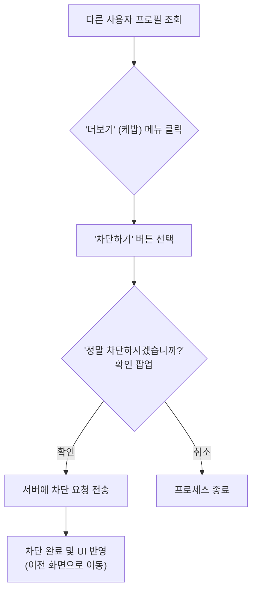
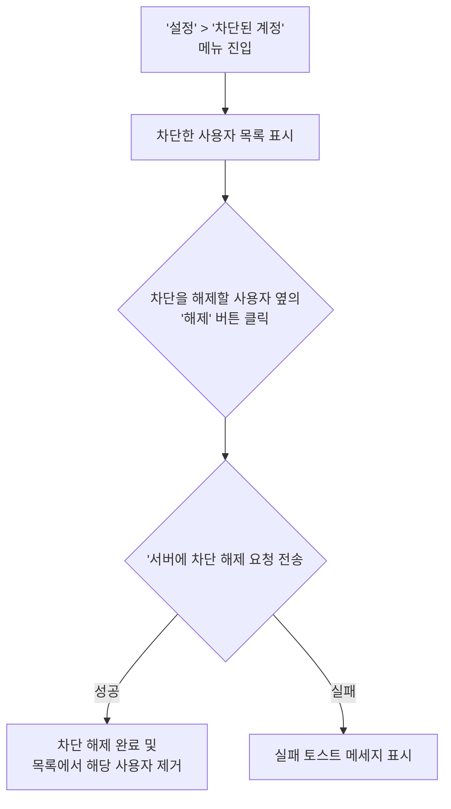

# 프로젝트명: 차단 기능 개발 회의

## 작성자

- 신동원
- 이동권
- 이주현

## 개요

> 이 프로젝트는 무엇인지, 목적은 무엇이며, 무엇을 달성하고자 하는지 간략하게 설명합니다.
> 

이 프로젝트는 사용자가 다른 특정 사용자와의 원치 않는 상호작용을 차단할 수 있는 기능을 구현하는 것을 목표로 합니다. 사용자는 다른 사용자를 차단하여 자신의 정보 노출을 막고 채팅 등 서비스 내에서의 모든 직접적인 소통을 제어할 수 있습니다. 이를 통해 안전하고 쾌적한 커뮤니티 환경을 조성하고 사용자의 서비스 만족도를 높이는 것을 목적으로 합니다.

## 배경 및 동기

> 프로젝트의 배경을 설명합니다. 왜 이 프로젝트가 필요한가요? 어떤 문제를 해결하나요?
> 

현재 서비스에는 사용자 간의 불쾌하거나 원치 않는 상호작용을 사용자가 직접 제어할 수 있는 수단이 없습니다. 스팸, 괴롭힘, 또는 개인적인 이유로 특정 사용자와의 소통을 원치 않는 경우, 이를 피할 방법이 없어 사용자들이 불편을 겪거나 최악의 경우 서비스 이탈로 이어질 수 있습니다. 회원 차단 기능은 이러한 문제를 해결하여 사용자에게 자신의 활동 환경에 대한 통제권을 부여하고, 유해한 상호작용으로부터 스스로를 보호할 수 있는 필수적인 수단을 제공하고자 합니다.

### 목표

> 이 프로젝트의 목표를 명확하게 기술합니다.
주요 결과물을 나열합니다.
> 
- **사용자 차단 기능:** 특정 사용자를 지정하여 차단 목록에 추가할 수 있습니다.
- **상호작용 차단:** 차단된 사용자는 차단한 사용자에의 운동장소를 조회할 수 없으며, 채팅을 할 수 없습니다.
- **차단 목록 관리:** 사용자는 자신이 차단한 사용자 목록을 확인하고, 원할 때 차단을 해제할 수 있습니다.
    
    

### 비목표

> 이 프로젝트의 범위에 포함되지 않는 것을 명시합니다.
> 
- **콘텐츠 신고 시스템:** 특정 게시물이나 사용자를 운영자에게 신고하는 기능은 이번 프로젝트의 범위에 포함되지 않습니다. 이는 추후 별도의 프로젝트로 계획합니다.
- **관리자 수준의 제재:** 운영자가 특정 사용자를 서비스에서 영구적으로 추방하는 기능은 고려하지 않습니다. 이 기능은 사용자 간의 상호작용 제어에 초점을 맞춥니다.

## 상세 설계(솔루션 제안)

> 시스템 아키텍처에 대한 상세한 설명을 제공합니다. 
필요하다면 다이어그램, 순서도, 모델 등을 포함합니다.
> 

### 시스템 아키텍처

> 시스템의 전반적인 아키텍처를 설명합니다.
> 
- **Client (iOS/Android App):** 사용자 프로필에서 다른 사용자를 차단 UI를 제공합니다. 또한, 마이페이지에서 차단된 사용자 목록을 조회하고 차단 해제하는 UI를 제공합니다. 차단된 사용자의 운동 장소 정보는 서버로부터 제외되어 받습니다. 서버와는 REST API를 통해 차단 관련 요청을 주고받습니다.
- **Backend Server:** 사용자 간의 차단 관계를 관리하는 비즈니스 로직을 담당합니다. 특히 운동 장소 조회 API와 채팅 관련 API 요청 시, 요청자와 대상자 간의 차단 상태를 확인하여 데이터 반환 및 기능 수행 여부를 결정합니다.
- **Database:** 사용자 A가 사용자 B를 차단했는지를 나타내는 '차단 관계' 테이블(member_blocks)을 추가하여 데이터를 저장합니다. 이 테이블은 차단한 사용자 UUID와 차단된 사용자 UUID를 유니크 컬럼으로 가집니다.

### 구성 요소 (Components)

> 시스템의 각 구성 요소, 책임, 그리고 상호작용에 대해 상세히 기술합니다.
> 
1. **사용자 차단 시스템**
    - 사용자 프로필에서 차단 기능을 호출합니다.
    - 서버에 차단 요청을 보내고, 데이터베이스에 차단 관계를 생성합니다.
2. **차단 목록 관리 시스템**
    - '설정' 에서 '차단된 계정' 메뉴를 제공합니다.
    - 사용자는 이 메뉴를 통해 자신이 차단한 사용자 목록을 조회하고, 목록에서 특정 사용자를 선택하여 차단을 해제할 수 있습니다.
3. **상호작용 제어 시스템**
    - **운동 장소 조회 제한:** 운동 장소 정보를 반환하는 API에서 요청자와 장소 소유자 간의 차단 관계를 확인합니다. 차단 관계가 존재할 경우, 해당 장소 정보를 결과에서 제외합니다.
    - **채팅 제한:** 채팅 메시지 전송, 채팅방 생성 등 채팅 관련 API에서 두 사용자 간의 차단 관계를 확인합니다. 차단한 사용자는 메시지를 입력할 수 없으며 입력필드에 “차단한 회원과는 대화할 수 없습니다”라는 시스템 메시지를 제공합니다. 차단된 사용자는 메시지를 입력할 수 있지만 차단한 사용자가 메시지를 수신하지 않습니다.

### 유저 플로우

> 사용자의 유저 플로우를 설명합니다.
> 

### **1. 사용자 차단 플로우**

- **플로우 설명**:
    1. 차단하고 싶은 사용자의 프로필 화면으로 진입합니다.
    2. '더보기' 메뉴에서 '차단하기' 옵션을 선택합니다.
    3. 확인 팝업에서 '확인'을 누르면 차단이 완료되고, 이전 화면으로 돌아갑니다.

### **2. 차단 해제 플로우**

- **플로우 설명**:
    1. '설정' 화면 내 '차단한 회원' 메뉴로 이동합니다.
    2. 현재 차단 중인 사용자 목록이 나타납니다.
    3. 차단을 풀고 싶은 사용자 옆의 '해제' 버튼을 누릅니다.
    4. 차단을 해제하고, 서버 요청 성공 시 목록에서 해당 사용자가 사라집니다.

### API

> 다른 구성 요소 및 시스템 간의 인터페이스를 문서화합니다.
> 
- **차단 관리 API**
    - POST `/api/v1/members/{memberId}/block`
        - **설명:** 특정 사용자({memberId})를 차단합니다.
    - DELETE `/api/v1/members/{memberId}/block`
        - **설명:** 특정 사용자({memberId})에 대한 차단을 해제합니다.
    - GET `/api/v1/members/blocks`
        - **설명:** 현재 사용자가 차단한 모든 사용자의 목록을 조회합니다.
- **차단 로직 적용이 필요한 기존 API**
    - GET `/api/v1/members`
        - **설명:** 다른 회원의 운동장소 목록 조회시 차단한 회원과 차단된 회원은 상호간의 조회가 되지 않도록 설정합니다.
    - GET `/api/v1/chat-rooms`
        - **설명:** 차단한 회원의 경우 차단된 회원이 보내는 메시지를 수신하지 않아야 합니다. 또한, 차단된 회원이 새로운 채팅방을 생성하는 경우, 해당 채팅방은 조회되지 않아야 합니다. 추가적으로 채팅방 목록 조회 시 다른 회원의 식별자를 반환하여 차단 등록을 수행할 수 있도록 합니다.
    - GET `/api/v1/chat-rooms/{chatroomId}/messages?prevChatId={prevChatId}&size={size}`
        - **설명:** 특정 채팅방 조회시 상대방이 차단된 회원인지 여부를 반환해야 합니다
    - POST `/api/v1/chat-rooms/{chatroomId}/messages`
        - **설명:** 메시지 전송 시 발신자와 수신자 간의 차단 관계를 확인하여 발신자가 수신자를 차단한 경우 발신측에서 메시지 전송을 실패 처리합니다.
    

## 위험 요소 및 완화 방안(롤백 및 테스트 계획)

> 잠재적인 위험 요소를 식별하고 이를 완화하기 위한 전략을 요약합니다.
> 

### **위험 요소**

- **성능 저하:** 운동 장소 목록 조회, 채팅 등 빈번한 API 호출 시마다 차단 여부를 DB에서 확인하면 성능 저하가 발생할 수 있습니다.
    - **완화 방안:** 차단 관계 정보를 인메모리 캐시에 저장하여 DB 부하를 줄이고 응답 속도를 개선합니다.
- **차단 로직 누락:** 운동 장소를 조회할 수 있는 새로운 API가 추가될 때, 차단 확인 로직이 누락되어 정보가 노출될 위험이 있습니다.
    - **완화 방안:** 사용자 간 상호작용을 처리하는 API는 AOP를 통해 차단 확인 로직을 일괄 적용하여 누락 가능성을 최소화합니다.

### 롤백

- 배포 후 기능 오작동이나 심각한 성능 문제가 발견될 경우, 이전 배포 버전으로 즉시 롤백을 진행합니다.

### 테스트 전략

- 각 개발 분야 별로 유닛 테스트, 통합 테스트를 수행한 후 개발서버에 배포합니다. 배포된 개발 서버에서 인수 테스트를 진행하고 배포서버에 배포를 진행한 후 최종적으로 QA테스트를 진행합니다.

### UI

- 프로필 조회 → 다른 회원 차단 기능 추가

- 마이페이지 → 차단된 회원 목록 조회 및 차단 해제

    

## 결론

> 디자인 독의 핵심 내용을 요약하고 프로젝트의 목표를 다시 한번 강조합니다.
> 

회원 차단 기능은 사용자가 서비스 내에서 원치 않는 상호작용을 제어할 수 있게 하는 안전장치입니다. 차단 기능 개발을 통해 타인에게 보이는 운동 장소 노출과 채팅 기능을 제어함으로써 사용자는 더욱 안전한 환경에서 서비스를 이용할 수 있게 될 것입니다. 이는 장기적으로 커뮤니티의 건강성을 유지하고 사용자의 서비스 이용 편의성을 높이는 데 기여할 것으로 생각됩니다.
