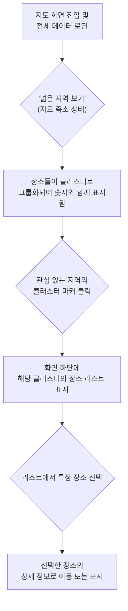

# 프로젝트명: 클러스터링 기능 관련 회의

## 작성자

- 신동원
- 이동권
- 이주현

## 개요

> 이 프로젝트는 무엇인지, 목적은 무엇이며, 무엇을 달성하고자 하는지 간략하게 설명합니다.
> 

이 프로젝트는 현재 카카오맵에 개별 마커로 표시되는 회원의 운동 장소에 클러스터링(Clustering) 기능을 도입하는 것을 목표로 합니다. 사용자가 지도를 넓게 축소했을 때, 인접한 여러 개의 장소 마커를 하나의 그룹 마커(클러스터)로 묶어서 보여줌으로써 지도의 가독성을 향상시키고자 합니다. 이를 통해 사용자는 특정 지역의 운동 장소 밀집도를 한눈에 파악하고, 더 쾌적하게 지도를 탐색할 수 있습니다.

## 배경 및 동기

> 프로젝트의 배경을 설명합니다. 왜 이 프로젝트가 필요한가요? 어떤 문제를 해결하나요?
> 

현재 지도 기능은 등록된 모든 운동 장소를 개별 마커로 표시하고 있습니다. 특정 지역에 운동 장소가 밀집되어 있을 경우, 수많은 마커가 서로 겹쳐 화면이 복잡해지고 어떤 정보가 있는지 파악하기 어려워 사용자 경험을 해치는 문제가 있습니다. 클러스터링 기능은 이러한 문제를 해결하여 사용자에게 훨씬 직관적이고 쾌적한 지도 탐색 경험을 제공하기 위해 필요합니다.

### 목표

> 이 프로젝트의 목표를 명확하게 기술합니다.
주요 결과물을 나열합니다.
> 
- **지도 클러스터링 기능 구현:** 지도 축척(Zoom Level)에 따라 인접한 마커들을 자동으로 그룹화하여 숫자와 함께 표시합니다.

### 비목표

> 이 프로젝트의 범위에 포함되지 않는 것을 명시합니다.
> 
- **서버사이드 클러스터링:** 이번 프로젝트에서는 클라이언트(웹,앱) 단에서 클러스터링 로직을 처리하는 것을 목표로 합니다. 방대한 데이터를 서버에서 미리 그룹화하여 내려주는 방식은 고려하지 않습니다.

## 상세 설계(솔루션 제안)

> 시스템 아키텍처에 대한 상세한 설명을 제공합니다. 
필요하다면 다이어그램, 순서도, 모델 등을 포함합니다.
> 

### 시스템 아키텍처

> 시스템의 전반적인 아키텍처를 설명합니다.
> 

이 기능은 주로 클라이언트 사이드에서 구현됩니다.

- **Client (iOS/Android App):** 지도 화면에 처음 진입할 때, 서버에 전국의 모든 운동 장소 데이터를 한 번에 요청합니다. 이후, 카카오맵 SDK에서 제공하거나 외부 클러스터링 라이브러리를 사용하여 가져온 데이터를 화면상에서 그룹화합니다. 사용자의 확대/축소, 이동 등 상호작용에 따라 실시간으로 클러스터를 재계산하고 표시합니다.
- **External Services:** 카카오맵 SDK 및 이에 맞는 클러스터링 라이브러리.
    - 안드로이드의 경우 카카오맵 sdk에서 클러스터링을 지원하지 않습니다. 
    아래의 라이브러리를 일부 사용하여 구현할 예정입니다.
    - https://github.com/ParkSangGwon/TedNaverMapClustering

### 구성 요소 (Components)

> 시스템의 각 구성 요소, 책임, 그리고 상호작용에 대해 상세히 기술합니다.
> 
1. **초기 데이터 로딩 및 캐싱 모듈 (Client)**
    - 지도 화면에 진입하는 시점에, 서버에 전체 장소 데이터 목록을 요청합니다.
2. **클러스터링 엔진 (Client)**
    - 캐싱된 전체 장소 데이터 목록을 클러스터링 라이브러리에 전달합니다.
    - 라이브러리는 현재 지도의 축척 레벨과 마커들의 화면상 거리를 기준으로 마커들을 그룹화합니다.
3. **사용자 상호작용 핸들러 (Client)**
    - **클러스터 탭:** 사용자가 클러스터 마커를 클릭하면, 해당 클러스터에 포함되어있는 장소 데이터 리스트를 표시합니다.

### 유저 플로우

> 사용자의 유저 플로우를 설명합니다.
> 

- **플로우 설명**:
    1. 사용자가 지도에 진입하면, 모든 장소 데이터를 로드하여 클러스터링된 형태로 지도를 보여줍니다.
    2. 사용자가 특정 클러스터 마커를 클릭합니다.
    3. 화면 하단에서 해당 클러스터에 속한 장소들의 목록(리스트)이 나타납니다.
    4. 사용자는 목록을 스크롤하며 장소들을 확인하고, 특정 장소를 선택하여 상세 정보를 볼 수 있습니다.

### 

### API

> 다른 구성 요소 및 시스템 간의 인터페이스를 문서화합니다.
> 

기존에 개발된 API를 사용합니다.

- **GET** /api/v1/members
    - **설명**: 지도에서 확인 가능한 다른 회원들의 운동 장소 목록을 조회하는 API 입니다.

## 위험 요소 및 완화 방안(롤백 및 테스트 계획)

> 잠재적인 위험 요소를 식별하고 이를 완화하기 위한 전략을 요약합니다.
> 

### **위험 요소**

- **저사양 기기에서의 성능 문제:** 수만 개의 데이터를 받아와 클라이언트에서 클러스터링을 수행할 경우, 저사양 기기에서 CPU 사용량이 급증하여 앱이 느려지거나 멈출 수 있습니다.
    - **완화 방안:** 한 번에 받아오는 최대 데이터 개수에 제한을 두거나, 특정 줌 레벨 이하에서는 데이터 요청을 막는 방식을 고려할 수 있습니다.

### 롤백

- 배포 후 기능 오작동이나 심각한 성능 문제가 발견될 경우, 이전 배포 버전으로 즉시 롤백을 진행합니다.

### 테스트 전략

- 각 개발 분야 별로 유닛 테스트, 통합 테스트를 수행한 후 개발서버에 배포합니다. 배포된 개발 서버에서 인수 테스트를 진행하고 배포서버에 배포를 진행한 후 최종적으로 QA테스트를 진행합니다.

## 결론

> 디자인 독의 핵심 내용을 요약하고 프로젝트의 목표를 다시 한번 강조합니다.
> 

지도에 마커 클러스터링 기능을 도입함으로써, 사용자는 운동 장소가 밀집된 지역에서도 시각적으로 정돈된 정보를 얻을 수 있으며, 한층 부드럽고 쾌적한 지도 탐색이 가능해집니다. 이는 사용자의 지도 기능 만족도를 크게 향상시킵니다.
